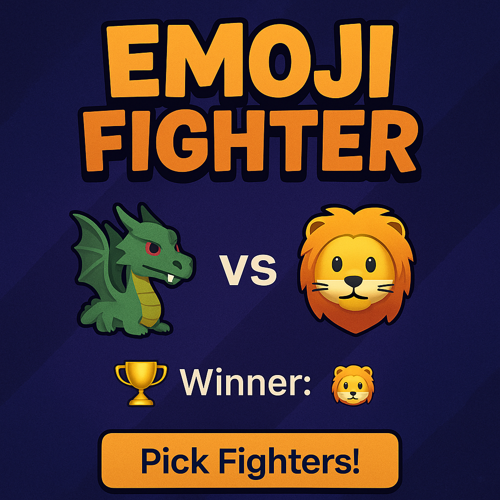

# 🥊 Emoji Fighter Showdown

**Emoji Fighter Showdown** is a fun browser-based game where two random emoji characters battle on-screen — and the stronger one wins based on their power level!

---

## 🎮 Gameplay

Click the **"Pick Fighters!"** button and watch two emoji fighters face off in a hilarious and unexpected showdown. The winner is chosen based on their predefined strength — no random luck here!

### Example:
- 🐉 Dragon (95 Power)  
- 🐥 Chick (40 Power)  
➡️ Winner: **🐉 Dragon**

---

## 🧠 How It Works

- Emoji fighters are chosen randomly from a predefined list.
- Each emoji has a **power level** (defined in `script.js`).
- The emoji with the higher power is declared the **winner**.
- The fight visuals are shown dynamically in the browser.

---

## 🧱 Built With

- **HTML5** – Game layout
- **CSS3** – Custom styling and animations
- **Vanilla JavaScript** – Core game logic & DOM updates

---

🙌 Credits
Crafted with 💛 for fun and learning!

